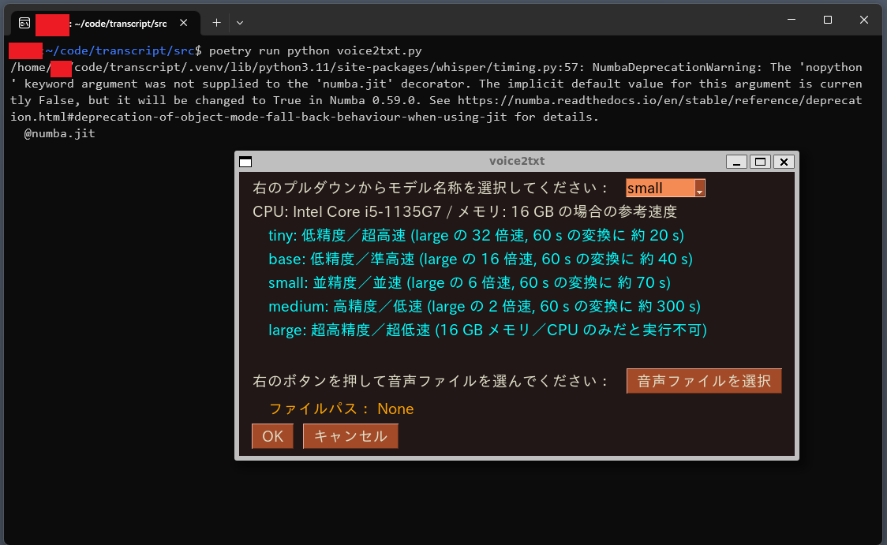
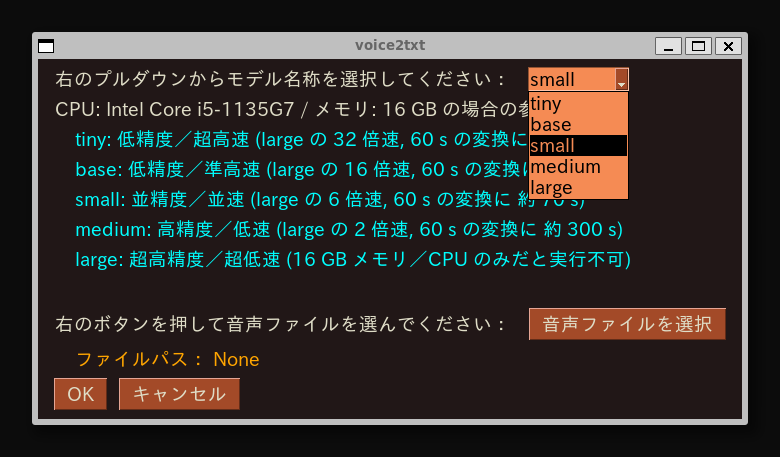
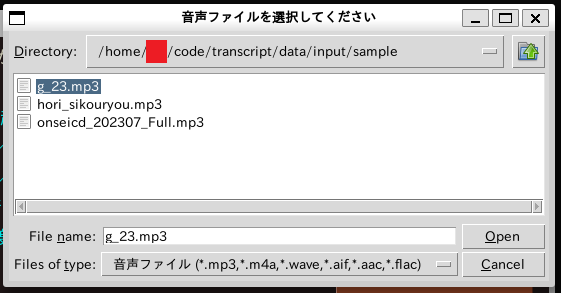
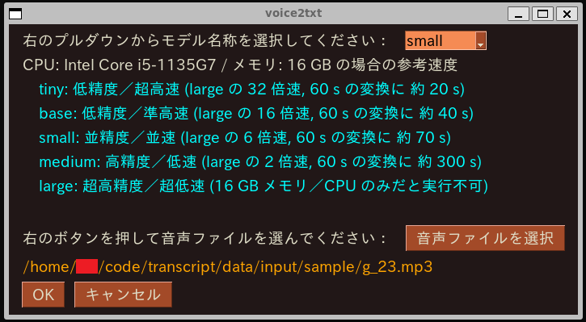
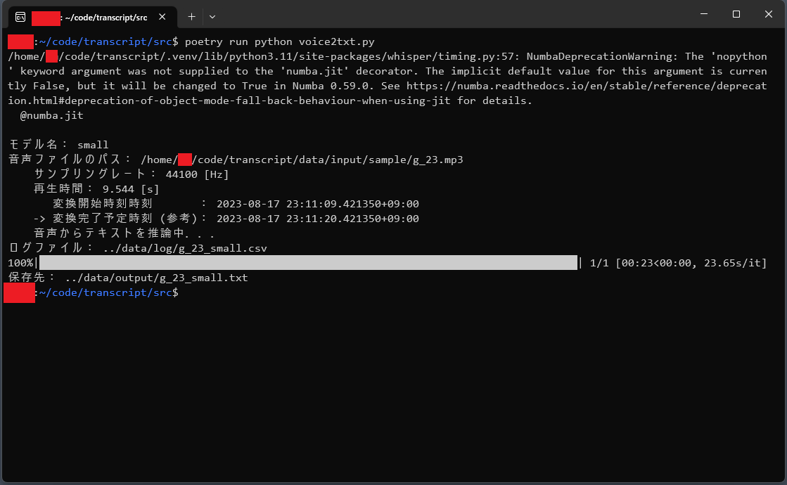
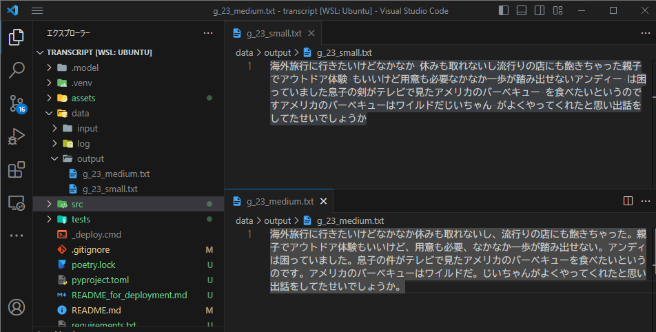

# 音声／動画ファイルを読み込んで文字起こしを行うツール

## 概要

[openai whisper](https://github.com/openai/whisper) を用いて，音声／動画ファイルを読み込んで文字起こしを行うツールです．  
[PySimpleGUI](https://github.com/PySimpleGUI/PySimpleGUI) を用いて作成した GUI によって，AI モデルと文字起こししたい音声／動画ファイルを選択することにより，文字起こしが可能です．  
会議議事録作成の雛形や，音声／動画データを文字列で残しておきたい時にご使用ください（ただし，完璧に文字起こしされない場合があり，求めていた検索結果が文字列完全一致検索では得られないかもしれませんので，ご了承ください）．
また，例えば社内の AI やプログラミングなどに疎い人も使用できるように，python embeddable package を用いた展開用パッケージ作成については，こちらの [web サイト](https://slash-z.com/embeddable-python-whisper) にて説明していますので，ご興味あればご覧ください．
Python embeddable package を使用する場合は環境構築が不要で，`./src/voice2txt.bat` を実行するだけで上記ツールが起動できるようにしています．

## 使用想定環境

- Windows 10 / 11
- WSL2
- pyenv + poetry
- CPU のみ

## 環境構築

WSL2 上にて pyenv + poetry が使用可能な状態で，以下を実行することで環境構築が可能です．

```bash
pyenv install 3.11.4
pyenv local 3.11.4
poetry install
```

## 使用方法

1. `環境構築` のとおり環境構築を行います．
2. カレントディレクトリを `./src` とした状態で，以下コマンドにより起動します．
   ```bash
   poetry run python voice2txt.py
   ```
3. 数秒後に GUI 操作画面が立ち上がります．  
   
4. プルダウンメニューからモデルを選択します．  
   
5. 「音声／動画ファイルを選択」 のボタンを押すとエクスプローラーが立ち上がるので，変換したいファイルを選択します．  
   エクスプローラーでファイルを選択したら，そのファイルをダブルクリックするか，もしくは開くボタンでファイルを開きます．
   
6. GUI に選択内容が反映されますので，内容が良ければ OK ボタンで文字起こしがスタートします．  
   
7. 変換処理が終われば起動しているシェルは不要なので，「続行するには何かキーを押してください．．．」と入力待ちになっているため何かキーを押すか，右上の ☓ でウィンドウを閉じてください．  
   
8. 変換後のファイルは，`{音声／動画ファイル名}_{モデル名}.txt` としています．  
   `small` と `medium` の出力結果について比較すると，`small` もかなり精度良く文字起こしができていますが，`medium` では句読点も追加されていて，より一層読みやすく変換されていることが示されています．  
   

## 免責事項

- 当該ツールの動作，発生した結果，維持，管理について一切の責任を負わず，バグ改修や保守／改良などについては，基本的にはお受けできません．ご了承ください．

## 注意／補足事項

- 文字起こしの AI モデル選択において，CPU のみ 16GB メモリの PC では `large` モデルを選択いたしますとエラーでプログラムが強制終了します．左記より仕様よりハードウェア側を強化しない限りは対処方法はありませんので，左記ハードウェア要件レベルであれば `medium` やそれ以下の軽量のモデルを選択ください．
- GPU を用いたい場合は，GPU 使用のための環境構築の他に，`./src/voice2txt.py` の 23 行目の `torch.cuda.is_available = lambda: False` を `True` に書き換える必要があります．
- 結果が出るまでに時間がかかりますがモデルは `medium` を用いることを推奨します．`small` でもなんとなく伝わる結果になりますが，`small` より軽量のモデルだと良く分からない結果になりやすいです．
- リファクタリングなど手が行き届いてないところもあり，特に GUI については全く凝っていません．

## Rev.

- 2023/07/26 [v0.0]: 初版
- 2023/08/17 [v0.1]:
  - README.md を更新
  - README_for_deployment.md と切り分け
  - 完全ローカルに対応するために，こちら (https://github.com/openai/whisper/discussions/1399) を見て対応
