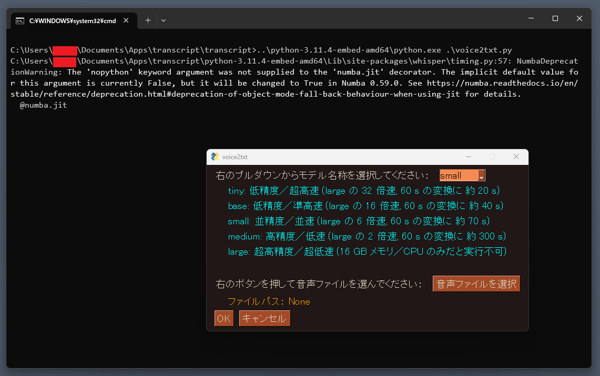
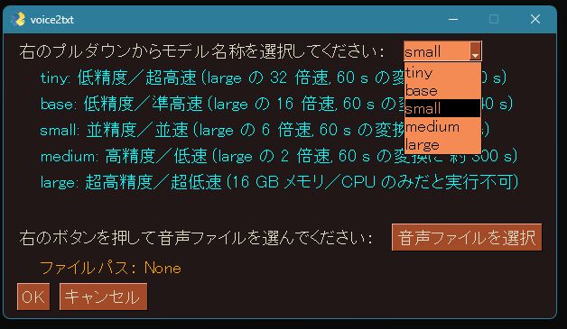
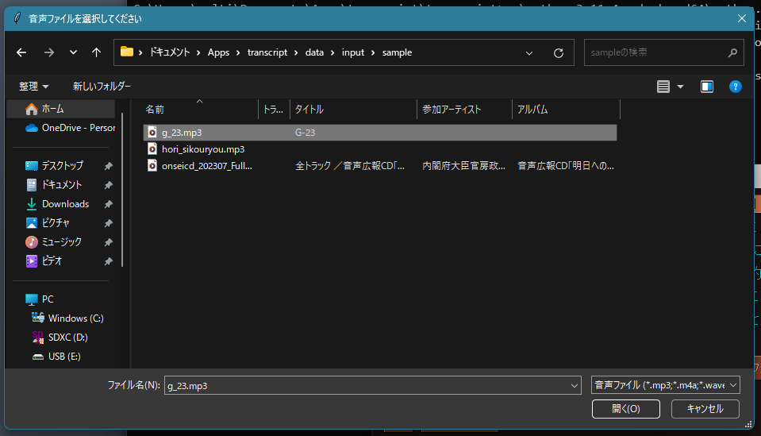
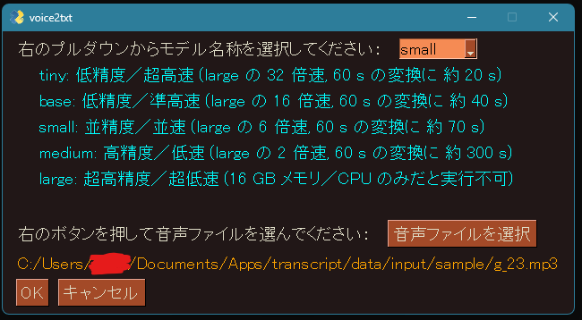
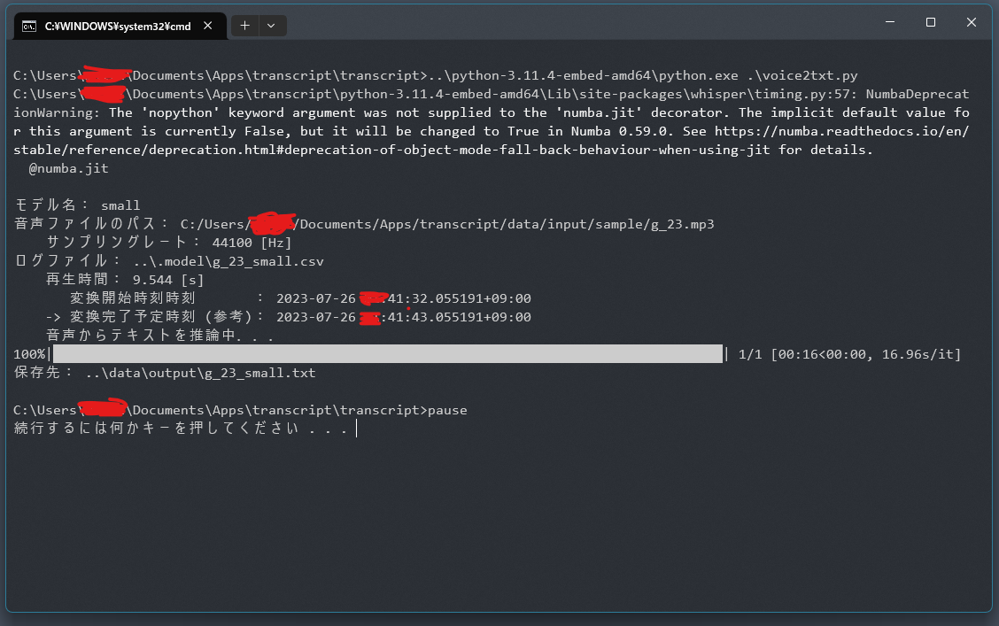
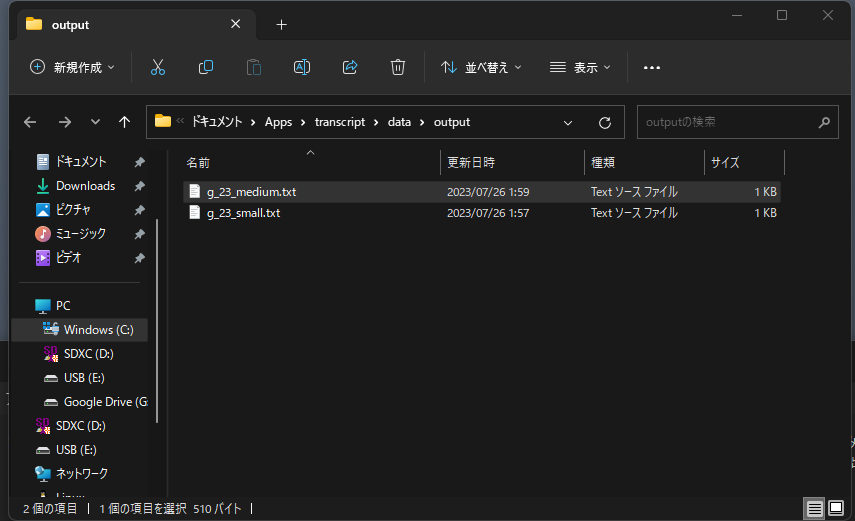
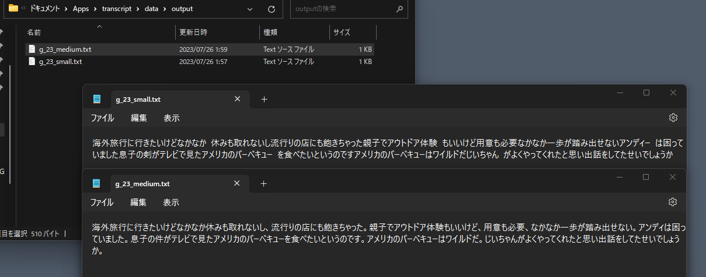

# 音声ファイルを読み込んで文字起こしを行うツール

## 概要

[openai whisper](https://github.com/openai/whisper) を用いて，音声ファイルを読み込んで文字起こしを行うツールです．  
[PySimpleGUI](https://github.com/PySimpleGUI/PySimpleGUI) を用いて作成した GUI によって，AI モデルと文字起こししたい音声ファイルを選択することにより，文字起こしが可能です．  
環境構築が不要で `./src/voice2txt.bat` を実行することにより，上記ツールが起動します．  
会議議事録作成の雛形や，音声データを文字列で残しておきたい時にご使用ください（ただし，完璧に文字起こしされない場合があり，求めていた検索結果が文字列完全一致検索では得られないかもしれませんので，ご了承ください）．

## 使用想定環境

- Windows 10 / 11
- CPU のみ

## 環境構築

実行環境含めオールインワンにしているため，環境構築は不要です．  
.tar.gz ファイル展開後でこのファイルを見ている段階では，そのまま使用することができます．

## 起動方法

`./src/voice2txt.bat` を実行するだけです．  
（もっと手軽に当該ツールを起動する方法としては，このバッチファイルのショートカットを作成し，`C:\Users\{ユーザ名}\AppData\Roaming\Microsoft\Windows\Start Menu\Programs` にショートカットファイルを移動することで，スタートメニューにピン止めすることができます．追加されたアイコンをクリックすることで，当該ツールを起動できます．もちろん，.bat のショートカットファイルを任意のフォルダに移動してダブルクリックにて実行されても起動できます．）

## 使用方法

1. `./src/voice2txt.bat` を実行（ダブルクリックなど）します．
2. 下図のシェルが立ち上がった後に GUI 操作画面が立ち上がります．  
   
3. プルダウンメニューからモデルを選択します．  
   
4. 「音声ファイルを選択」 のボタンを押すとエクスプローラーが立ち上がるので，変換したいファイルを選択します．  
   エクスプローラーに表示される初期のディレクトリ階層は `./data/input/` で，`./data/input/sample/` に同梱されているファイルは全てフリーの音声データです．  
   エクスプローラーでファイルを選択したら，そのファイルをダブルクリックするか，もしくは開くボタンでファイルを開きます．
   
5. GUI に選択内容が反映されますので，内容が良ければ OK ボタンで文字起こしがスタートします．  
   
6. 変換処理が終われば起動しているシェルは不要なので，「続行するには何かキーを押してください．．．」と入力待ちになっているため何かキーを押すか，右上の ☓ でウィンドウを閉じてください．  
   
7. 変換処理の終了と同時に，変換ファイルが保存されているディレクトリ `./data/output/` が自動で開きます．  
   変換後のファイルは，`{音声ファイル名}_{モデル名}.txt` としています．  
      
    `small` と `medium` の出力結果について比較すると，`small` もかなり精度良く文字起こしができていますが，`medium` では句読点も追加されていて，より一層読みやすく変換されていることが示されています．  
    

## 免責事項

- 当該ツールの動作，発生した結果，維持，管理について一切の責任を負わず，バグ改修や保守／改良などについては，基本的にはお受けできません．ご了承ください．
- 当該ツールを無断で二次配布することを禁止します．二次配布を希望される際はご相談ください．

## 注意／補足事項

- 文字起こしの AI モデル選択において，CPU のみ 16GB メモリの PC では `large` モデルを選択いたしますとエラーでプログラムが強制終了します．左記より仕様よりハードウェア側を強化しない限りは対処方法はありませんので，左記ハードウェア要件レベルであれば `medium` やそれ以下の軽量のモデルを選択ください．
- GPU を用いたい場合は，GPU 使用のための環境構築の他に，`./src/voice2txt.py` の 23 行目の `torch.cuda.is_available = lambda: False` を `True` に書き換える必要があります．
- 結果が出るまでに時間がかかりますがモデルは `medium` を用いることを推奨します．`small` でもなんとなく伝わる結果になりますが，`small` より軽量のモデルだと良く分からない結果になりやすいです．
- リファクタリングなど手が行き届いてないところもあり，特に GUI については全く凝っていません．

## Rev.

- 2023/07/26 [v0.0]: 初版
- 2023/08/17 [v0.1]:
  - README.md を更新
  - 完全ローカルに対応するために，こちら (https://github.com/openai/whisper/discussions/1399) を見て対応
